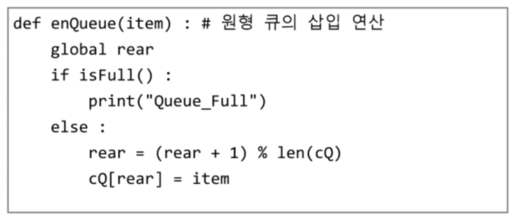

> Queue

* data의 삽입이 일어나는 곳 = `rear` , `enQueue; addQ()`연산을 사용
* data의 삭제가 일어나는 곳 = `front`, `deQueue; DeleteQ()`연산을 사용
* `isEmpty()` , `isFull()`

> 원형 큐

* 시작점과 끝점을 이어버리자!
* 선형큐의 경우, 둘 다 같은 idx를 가리키고 있으면 더이상 addQ 불가
* 원형큐의 경우, idx가 동일하더라도 순환이 가능하므로 addQ 가능
* 원형큐의 문제점은??
  * `isfull(), isempty()` 체크 할 때 front == rear로 check하게 됨
  * 해결방법
    * number_of_elem = 0 변수 설정해 준 뒤에, add할 때마다 +1, delete할 때마다 -1 해준 다음, `isfull(), isempty()` check를 하면 됨

​		rear를 size 안에서 돌게 하기 위해서 `% len(cQ)` (모듈러연산) 사용:star:

> DEQ (Doubly-Ended Queue)

* data의 삽입과 삭제가 큐의 양 끝에서 일어남
* AddQ_FRONT & Delete_FRONT / AddQ_REAR & Delete_REAR

> Linked list

* 노드 (node): data를 가지고 있고, 내가 다음에 가리킬 메모리 주소값을 가진 구조를 의미
* node - node - ... - node => node들끼리 연결되어 있는 구조
  * 단순 연결 리스트

> BFS (Breadth First Search)

