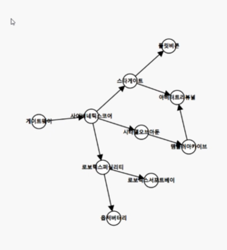

# 위상정렬 (topology sort)

```python
# BOJ 2252
indegree = [0] * (V+1)
graph = [[] for _ in range(V+1)]

# 간선 개수만큼 a, b를 받는다
for _ in range(E):
    a, b = map(int, input().split())
    graph[a].append(b)
    
    # 화살표 받는 애를 + 1
    # b로 가기 위한 요구사항 + 1
    indegree[b] = 1
    
result = []
q = deque()

for i in range(1, V+1):
    # indegree가 0이면 q에 넣어줘
    if indegree[i] == 0:
        q.append(i)
        
# 종료조건 = q가 빌 때까지
while q:
    now = q.popleft()
    result.append(now)
    
    # i == 나한테서 뻗어나가는 화살표들
    for i in graph[now]:
        # 화살표 끊기, 조건 하나 만족햇음
        indegree[i] -= 1
        # 이제 조건을 모두 만족했다면,
        if indegree[i] == 0:
            # 큐에 넣어줘
            q.append(i)
print(*result)
```


**순서가 정해져 있는 것이 있을 때, 순서대로 줄을 세우고 싶을 때**

위상정렬은 답이 여러개가 될 수 있다

모든 건물을 짓고 싶은데, 건물을 지을 수 있는 순서를 출력하는 것,,


* DAG (Directed Acyclic Graph) 일 때 위상정렬 사용 가능함
  * tree 구조가 떠오른다!

```python
# 나한테로 들어오는 가지의 숫자 배열
Indegree = [0]*(N+1)
'''
게이트웨이 0
1
1
1
1
1
1
1
아비터트리뷰널 2
1
'''

# 짓는데에 요구되는 조건이 없는 애를 큐에 넣어
queue = [게이트웨이]
# 게이트웨이를 지어
while q:
    node = q.popleft()
    # 게이트웨이에서 나가는 화살표가 끊기고, 그 화살표를 받는 애가 큐에 들어가
```

