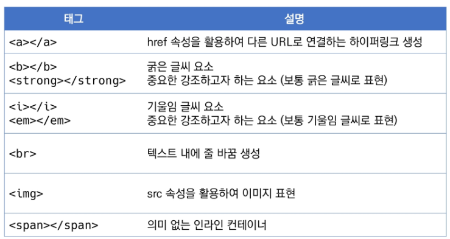

## HTML (Hyper Text Markup Language)

> HTML 기본 구조

```python
<!DOCTYPE html>
<html lang="en">
<head>
  <meta charset="UTF-8">
  <title>Document</title>
</head>
<body>
  
</body>
</html>
```

> DOM(Document Object Model) 트리

* parent-children
* sibling

> Element

* 내용이 없는 태그들 :star: 
  * hr, br, img, input, link, meta

* 텍스트 요소

  

  * strong, em 이 좀 더 시맨틱한 의미를 가지고 있다

    => 개발자들을 위해 강조/기울임 글씨 하는 것


>  CSS Display

**블록 레벨 요소와 인라인 요소**